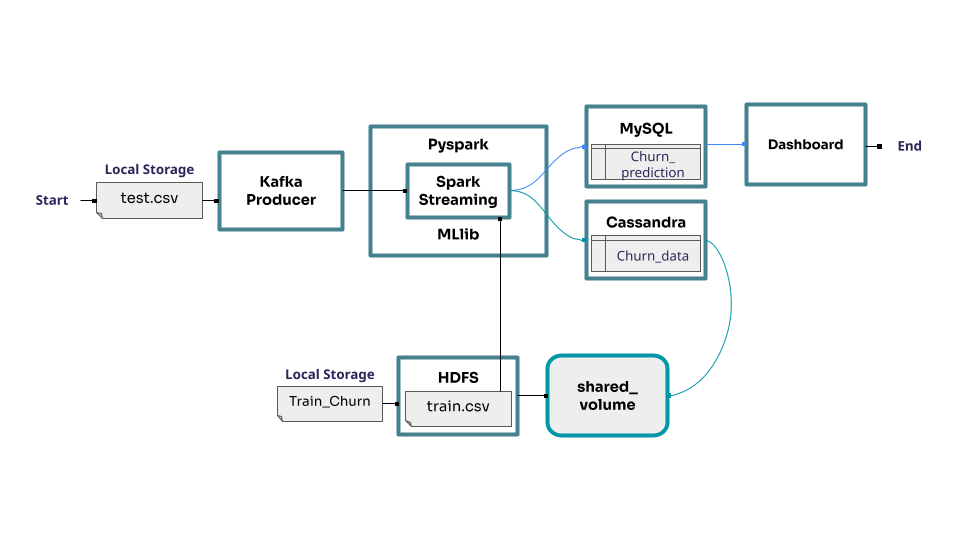

# Original Big-Data Stack Context

This cleaned repo is the deployable demo path. The broader project that inspired it used a larger local container stack for end-to-end data engineering and BI.

## Original container story

- Kafka brokers handled synthetic telecom customer events.
- Spark Structured Streaming consumed the topic and processed customer records.
- Hadoop/HDFS stored training data used for the churn model workflow.
- Additional stores and dashboards were used for downstream analytics and BI in the original environment.

## Why this repo is different

The deployable version in this repo is intentionally narrower:

- it is **standalone**
- it is **honest to host**
- it is **cheap enough for a public resume demo**

Instead of pretending the full cloud big-data stack is always-on in free hosting, this repo keeps the model, analytics API, dashboard, and live visitor-triggered synthetic stream. That makes the product easy to demonstrate while still preserving the original engineering story.

## Artifact carried over

The diagram below comes from the upstream project and documents the broader architecture you can discuss alongside the deployed demo:

